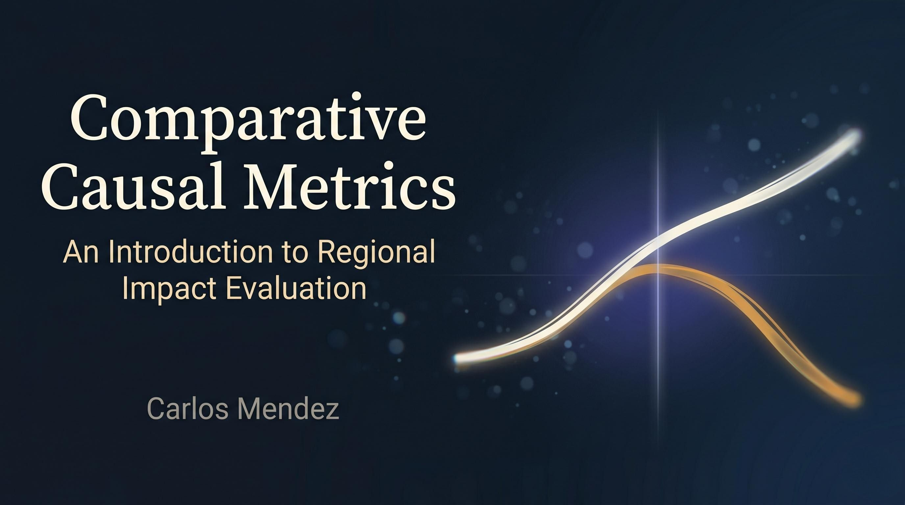

# Preface {.unnumbered}

{fig-alt="Comparative Causal Metrics cover image" .preview-image}

## About this book

*Comparative Causal Metrics* is an introduction to **regional impact evaluation** using modern causal-inference methods implemented entirely in **R** and rendered with **Quarto**. The book is organized in two parts, each anchored by a running case study and a different family of estimators.

### Who this book is for

The book is written for advanced undergraduates, master's students, and early-career researchers in econometrics, public policy, and spatial economics. Readers are assumed to know basic R (`tidyverse`-style data wrangling and fitting `lm()`) and one semester of econometrics (OLS, fixed effects, standard errors). No prior exposure to causal inference is assumed — chapter 1 introduces the potential-outcomes framework from scratch.

### Part I — One region, one shock

Chapters 1–7 evaluate **California's 1989 Proposition 99 cigarette tax**, the canonical single-treated-unit policy evaluation. Every method in this half builds a counterfactual for California from a different data source — the state's own past, a neighbour, a weighted blend of donor states, or a Bayesian time-series model — and reports the average treatment effect on the treated (ATT) between 1989 and 2000. The ATT compares California's observed cigarette sales after the policy against what they *would have been* without it; chapter 1 makes this missing-counterfactual logic precise.

- **Introduction** — the potential-outcomes vocabulary and a naive pre-post strawman estimate.
- **Interrupted time series** — extrapolating California's pre-period trajectory forward.
- **Basic difference-in-differences** — subtracting a single control state's pre-to-post change.
- **Classical synthetic control** — building a weighted donor blend that matches the pre-period.
- **Structural Bayesian time series** — state-space counterfactuals with posterior credible intervals.
- **Synthetic control with prediction intervals** — frequentist forecast-error decomposition via the `scpi` package.
- **Bayesian spatial synthetic control** — a horseshoe-prior donor blend with spatial spillovers onto neighbours.

### Part II — Many regions, staggered adoption

Chapters 8–10 evaluate the **Callaway-Sant'Anna minimum-wage county panel**, where thousands of counties adopted different state minimum-wage levels at different years. The single-treated-unit toolkit no longer applies: the estimand becomes a family of cohort-specific ATTs indexed by adoption year, and the methods exploit the panel's panel-data structure rather than a single time series.

- **Staggered difference-in-differences** — group-time ATT(g, t) estimators that avoid two-way fixed-effects bias.
- **Matrix completion and interactive fixed effects** — factor models that relax parallel trends.
- **Generalized synthetic control** — projecting treated units onto factors estimated from never-treated controls.

Each chapter pairs the conceptual logic of the method with a worked R example using publicly available data, so readers can reproduce every estimate end-to-end.

## How to read this book

The chapters are designed to be read sequentially but each is self-contained. Readers new to causal inference should start with chapter 1, which lays out the potential-outcomes vocabulary and a decision tree that maps each data situation to the appropriate method in this book. Code is folded by default — click **`</> Code`** in any chapter to reveal the underlying R. The full source is available [on GitHub](https://github.com/quarcs-lab/ccm). An on-demand PDF build of the book may also be available from the navbar; because PDFs are rebuilt only on request, the live PDF can lag a few commits behind the HTML site.

For readers who want to render a single chapter without cloning the repo, every numbered chapter offers a self-contained `.zip` bundle (chapter source, dataset, and a minimal `_quarto.yml`) at the bottom of the same **`</> Code`** dropdown. Unzip and run `quarto render <chapter>.qmd` — no `renv` setup required.

## Acknowledgments

This book builds on the infrastructure of the companion project [*Mastering Causal Metrics*](https://github.com/cmg777/intro2causal) and on a long tradition of applied econometric scholarship. The Proposition 99 panel used throughout Part I was assembled by @abadie2010synthetic; the staggered-adoption minimum-wage panel in Part II is the county-level dataset packaged with the `did` R package by @callaway2021difference. I am also grateful to the open-source maintainers of `tidysynth`, `Synth`, `CausalImpact`, `bsts`, `scpi`, `did`, `HonestDiD`, `fect`, and `gsynth` — every chapter in this book is a thin wrapper around their work.

## License

The text of this book is released under the [Creative Commons Attribution 4.0 International (CC-BY 4.0)](https://creativecommons.org/licenses/by/4.0/) licence, and all accompanying R code is released under the [MIT License](https://github.com/quarcs-lab/ccm/blob/main/LICENSE). You are free to reuse, adapt, and redistribute the material with attribution.

## How to cite

> Mendez, C. (2026). *Comparative Causal Metrics: An Introduction to Regional Impact Evaluation*. <https://quarcs-lab.github.io/ccm/>
